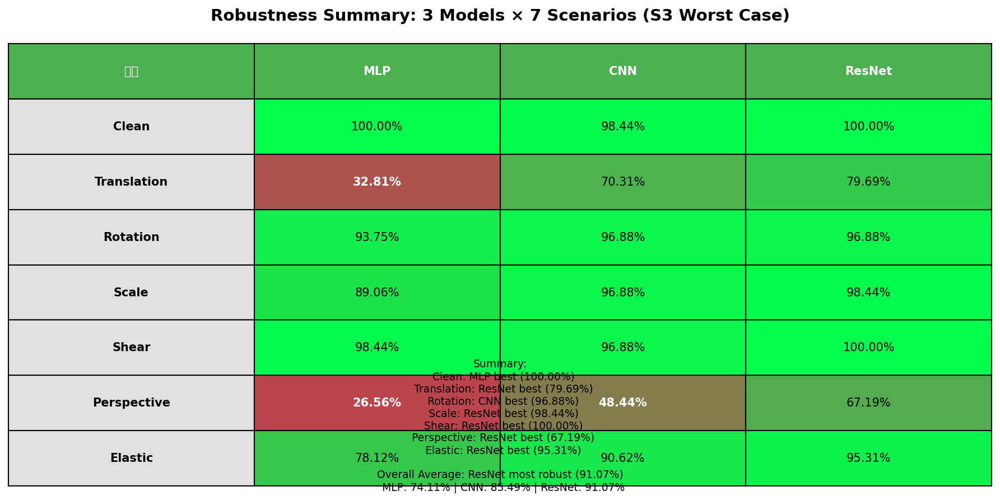
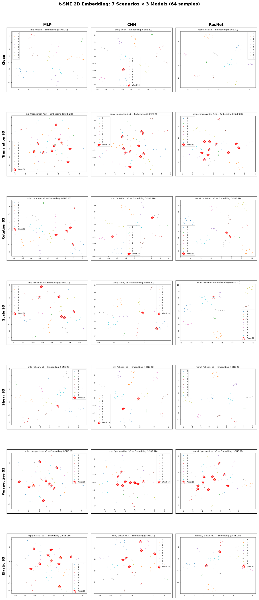

# 日誌 2026-02-09 — Robustness STEP 2 分析與結論

## 前提（請勿誤解）

- **評估子集**：MNIST test set 中，以**固定 seed（42）隨機抽樣 64 張**，作為所有 robustness 評估的樣本。
- **同一批圖**：clean、以及 6 種幾何破壞 × 3 個強度（s1/s2/s3），皆為**這同一批 64 張**經不同變換後的結果；三模型（MLP、CNN、ResNet）都吃同一批資料。
- **為何要寫清楚**：若只看這 64 張的 clean 結果，會出現 MLP 100%、CNN 98.44%（63/64）— 這是**小樣本抽樣**造成的表象，**並非**代表 MLP 整體優於 CNN。全 test set（10,000 張）上仍是 CNN、ResNet 優於 MLP；此處僅用 64 張做「同條件、可重現」的破壞比較。

---

## 分析

### 1. 三模型 × 7 情境（clean + 6 種破壞 S3）Accuracy 總結表

以下為**同一 64 張**在 clean 與各破壞 **S3（最壞強度）** 下的 accuracy。圖檔路徑：`outputs/robustness/robustness_summary_table.png`。

| 情境 | MLP | CNN | ResNet |
|------|-----|-----|--------|
| **Clean** | 100.00% | 98.44% | 100.00% |
| **Translation** | 32.81% | 70.31% | **79.69%** |
| **Rotation** | 93.75% | **96.88%** | 96.88% |
| **Scale** | 89.06% | 96.88% | **98.44%** |
| **Shear** | 98.44% | 96.88% | **100.00%** |
| **Perspective** | 26.56% | 48.44% | **67.19%** |
| **Elastic** | 78.13% | 90.63% | **95.31%** |

### 2. Clean 為何 CNN 比 MLP 低？

- 全 test set：CNN（約 99.13%）> MLP（約 97.83%）。
- 本表 clean 僅 64 張：MLP 64/64、CNN 63/64（**只錯 1 張**），故出現 100% vs 98.44%。
- 原因：**樣本數少 + 抽樣運氣**；這 64 張剛好讓 MLP 全對、CNN 錯一題，不代表 MLP 整體較強。解讀時應以「全 test 表現」為模型強弱依據，此表用於看**破壞前後相對變化**即可。

### 3. 各情境最佳與整體平均

- **各情境（S3）最佳**：Translation / Scale / Shear / Perspective / Elastic 皆為 **ResNet**；Rotation 為 CNN 與 ResNet 並列；Clean 為 MLP 與 ResNet 並列（見上表）。
- **7 情境平均 accuracy**：ResNet **91.07%** > CNN 85.49% > MLP 74.11%。

### 4. 哪種破壞最傷？

- **Perspective（透視）** 對三模型殺傷最大（S3 時 MLP 26.56%、CNN 48.44%、ResNet 67.19%）。
- **Translation（平移）** 次之；**Rotation / Shear / Scale** 對 CNN、ResNet 影響較小；**Elastic** 對 ResNet 仍可維持高準確率。

### 5. 為何 Translation（平移）破壞性大？

在 7 情境裡**準確率掉最多的是 Perspective**，**其次就是 Translation**。為何平移特別傷？

- **MLP**：輸入是 flatten 的 784 維，每個維度對應**固定像素位置**；學到的是「數字在**某個位置**長什麼樣子」。**平移**等於同一類別被搬到完全不同的維度，模型像看到新分佈，所以 S3 只剩約 32.8%。
- **CNN**：卷積有局部性與平移不變性，但 28×28 很小，**大平移**會讓數字貼邊、被裁掉或跑到邊界區域；MNIST 數字多半置中，平移後分佈偏離，S3 約 70%。
- **ResNet**：容量與層次更多，大平移仍會掉（S3 約 79.7%），但比 MLP/CNN 穩。

**小結**：位置敏感（尤其 MLP）、邊界裁切、訓練／測試分佈不一致，導致平移破壞性大。**Perspective** 更慘，因為除了位置還加上非線性變形與局部縮放，結構扭曲更大。

### 6. t-SNE 組合圖與 Embedding 分析

已將 **clean + 6 種幾何破壞 S3** 下、**三模型**的 t-SNE 2D 投影組合成一張圖：**7 列 × 3 欄 = 21 張縮圖**（列 = 情境，欄 = MLP / CNN / ResNet）。每張子圖為同一批 64 筆的最後一層 embedding 做 t-SNE，點依真實標籤上色，紅色星為該情境 **Worst 10**。

**解讀**：類別分群越清楚 → embedding 具可分性、準確率通常較高；點混在一起、紅星散落 → 錯誤多、準確率低。

- **Clean**：三模型都能把 10 類大致分開。
- **Translation S3**：MLP 點混成一團、紅星多（32.81%）；CNN 分群變模糊；ResNet 仍保有一定分群（79.7%）。
- **Perspective S3**：三模型都明顯變亂，MLP 最散，與準確率一致。
- **Rotation / Scale / Shear S3**：ResNet、CNN 多數仍維持分群；MLP 在 rotation/scale 稍亂。
- **Elastic S3**：ResNet 仍清楚；CNN、MLP 有部分混在一起。

整體上，t-SNE 的「分群品質」與各情境 **accuracy** 一致：越穩的模型與情境，點越按類別聚攏；越不穩的，點越混、Worst 10 越散。

**圖檔**：`outputs/robustness/tsne_combined_s3.png` · **腳本**：`scripts/create_tsne_combined.py`

---

## 結論

- **Robustness 表現**：**ResNet > CNN > MLP**（以 7 情境平均與多數破壞類型為準）。
- **前提務必保留**：本表為「固定 64 張、同一批圖」之結果；clean 欄位之高低**不代表**全 test set 上 MLP 優於 CNN，僅反映此子集上的抽樣差異。
- **實務**：若重視幾何破壞下的穩健性，應優先考慮 ResNet；若僅看 clean 或少數樣本，需避免過度解讀單一子集數字。

---

**圖檔**：`outputs/robustness/robustness_summary_table.png`、`outputs/robustness/tsne_combined_s3.png`
